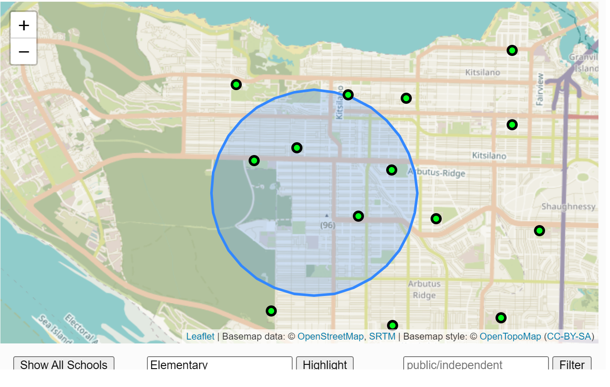

# ethan-lab2-Schools in Vancouver

Web link : https://ubc-geos472-spring2022.github.io/ethan-lab2/Schools.html

This map is designed for parents who have children who are planning to go to the nearby schools. The map summarizes elementary schools to high schools located in the Vancouver area. It has a search bar to find the name of the specific schools that parents want to look at. This map is helpful for some parents to decide the place to rent a house and the school that they want their children to attend within certain distances. The map at this moment only successfully addresses concerns for residents who live nearby the Dunbar area and the search radius is 1500 meters. The location and the radius are fixed for now, but I hope to improve it later to where people can manually set up their locations and their search radius. 

For the color theme that I used when designing the map, I set the color of the selected schools highlighted from the background color. For the iteration part, I make sure each step of my code works before adding some additional information. Such as first, make sure the base map is presenting well, then add buttons and create its corresponding listener. One of the buttons for the map is not working for now, but I did include the codes that I assume would work in the meantime the map is still working. The map is capable of zooming in and out. When the cursor passes the school listed on the map, the name of the school would show up.  The name of the streets is included in the map which provides more information for understanding. 

I choose a smooth background color for the map. The color for the location of schools compare to the base color is conspicuous. I set the radius of the circle to present all school locations smaller than the selected school's location. I choose the overall styling of the map to stay simple. When lots of schools are highlighted from the map, the audience won’t feel messy about the map. The improvements that I and my peer Zehao Lai discussed are first, trying to complete some of the functions of the map. Then adding more interaction by giving the map reader the ability to set the location and the search radius they want. Try to classify more about the data, categorize elementary schools, high schools, senior schools, etc.

Based on Table 1 of Norman's (1988) reading. One thing that I find would be helpful for my map would be creating a platform that “Support enabling operators (e.g., save, annotate, export) to collect insights during the interaction.” The government would establish more schools years after. To prevent the dataset get outdated, the dataset should be open to the users who may want to provide additional information as time goes on. Adding the function of retrieve would also prevent the dataset from being outdated. Humans always make mistakes, it’s hard to notice all the mistakes by themselves. Millions of users are capable of correcting mistakes made by others and providing accurate information to edit the false information. 
